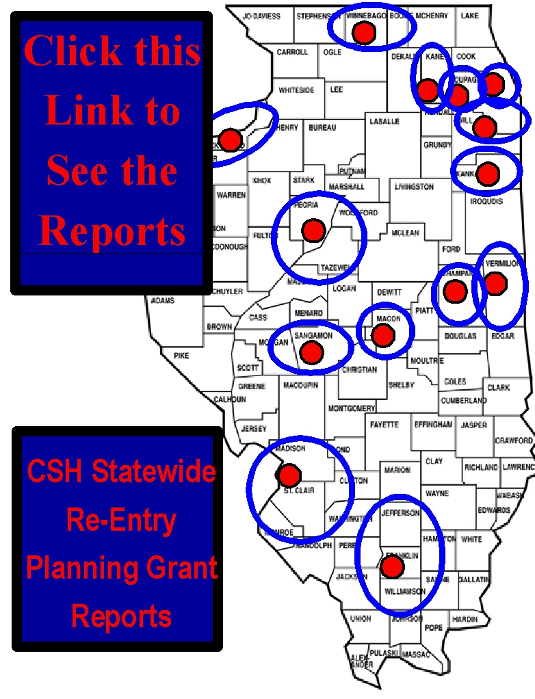

# Re-Entry Efforts Throughout Illinois

- [Chicago Metropolis 2020 Collaborative on Reentry]
- [Illinois WorkNet Ex-Offender Services]
- [City of Chicago Ex-Offender Reentry Initiatives]
- [State of Illinois Ex-Offender Employability]
- [Chicago Jobs Council]
- [Chicago Legal Advocacy to Incarcerated Mothers (CLAIM)]
- [Illinois Department of Human Services Training & Employment for Ex-Offenders]
- [Statewide Community Safety and Reentry Working Group]
- [The Sheriff of Cook County Re-Entry Council]
- [Waukegan Township Coalition to Reduce Recidivism]

[Chicago Metropolis 2020 Collaborative on Reentry]: http://www.metropolisstrategies.org/Collaborative-ee.html
[Illinois WorkNet Ex-Offender Services]: http://www2.illinoisworknet.com/
[City of Chicago Ex-Offender Reentry Initiatives]: http://www.cityofchicago.org/city/en/depts/mayor/supp_info/ex-offender_re-entryinitiatives.html
[State of Illinois Ex-Offender Employability]: http://www.ides.state.il.us/exoffenders/default.asp
[Chicago Jobs Council]: http://www.cjc.net/
[Chicago Legal Advocacy to Incarcerated Mothers (CLAIM)]: http://www.cgla.net/claim
[Illinois Department of Human Services Training & Employment for Ex-Offenders]: http://www.dhs.state.il.us/page.aspx?item=35568
[Statewide Community Safety and Reentry Working Group]: http://www.idoc.state.il.us/subsections/assistant_director/Press%20Paper%20--%20Reentry%20Working%20Group%20FINAL%20%28december%2017%202004%29.doc
[The Sheriff of Cook County Re-Entry Council]: http://www.chicagometropolis2020.org/documents/RebeccaJanowitz-AContextforConsideringReentryEffortsforCookCounty.pdf
[Waukegan Township Coalition to Reduce Recidivism]: http://www.waukegantownship.com/c2rr.html