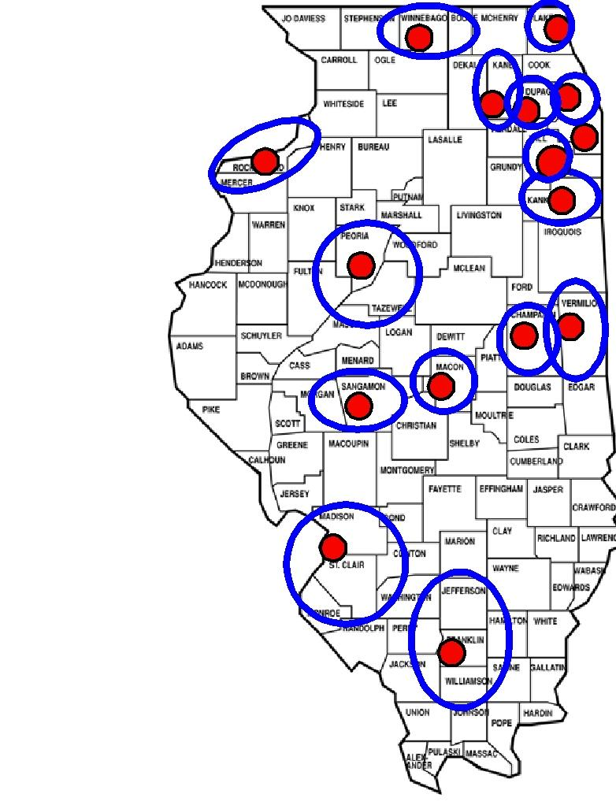

# CSH Illinois Releases Community Planning Grants from Across the State

Since October of 2008, 14 communities have been meeting to discuss the needs of their local communities for reentry housing and services as part of the [Re-Entry Planning Grant Initiative] funded by the [Corporation for Supportive Housing (CSH)] as part of the [Illinois Returning Home Initiative]. When [Metropolis 2020] convened the [Statewide Collaborative on Re-Entry], these communities assembled their most current recommendations for housing and programming. These reports were released September 30, 2009. Links to the Reports are below as well as a map of the communities in the reports. A [PowerPoint presentation] was also released summarizing the findings across reports.  Links to specific reports are provided below:

- [The City of Chicago]
- [Southern Cook County]
- [Lake County]
- [DuPage County]
- [Kane County]
- [Will County]
- [The Quad Cities and Rock Island County]
- [The City of Decatur and Macon County]
- [The City of Springfield and Sangamon County]
- [Champaign and Vermillion County]
- [The City of Peoria and Peoria County]
- [Madison & St Clair County (East St Louis Area)]
- [Williamson and Jefferson Counties (Mt Vernon and Marion, IL)]

[Re-Entry Planning Grant Initiative]: http://documents.csh.org/documents/il/partners.pdf
[Corporation for Supportive Housing (CSH)]: http://www.csh.org/
[Illinois Returning Home Initiative]: http://www.csh.org/index.cfm?fuseaction=Page.viewPage&pageId=4469
[Metropolis 2020]: http://www.chicagometropolis2020.org/
[Statewide Collaborative on Re-Entry]: http://media.webon.lycos.com/1426770/519451.doc
[PowerPoint presentation]: http://media.webon.lycos.com/1426770/519452.ppt

[The City of Chicago]: http://media.webon.lycos.com/1426770/403951.doc
[Southern Cook County]: http://media.webon.lycos.com/1426770/403956.doc
[Lake County]: http://media.webon.lycos.com/1426770/403960.doc
[DuPage County]: http://media.webon.lycos.com/1426770/403953.doc
[Kane County]: http://media.webon.lycos.com/1426770/404062.doc
[Will County]: http://media.webon.lycos.com/1426770/404462.doc
[The Quad Cities and Rock Island County]: http://media.webon.lycos.com/1426770/403967.doc
[The City of Decatur and Macon County]: http://media.webon.lycos.com/1426770/403962.doc
[The City of Springfield and Sangamon County]: http://media.webon.lycos.com/1426770/403952.pdf
[Champaign and Vermillion County]: http://media.webon.lycos.com/1426770/403945.doc
[The City of Peoria and Peoria County]: http://media.webon.lycos.com/1426770/584788.doc
[Madison & St Clair County (East St Louis Area)]: http://media.webon.lycos.com/1426770/546994.pdf
[Williamson and Jefferson Counties (Mt Vernon and Marion, IL)]: http://media.webon.lycos.com/1426770/403958.doc
